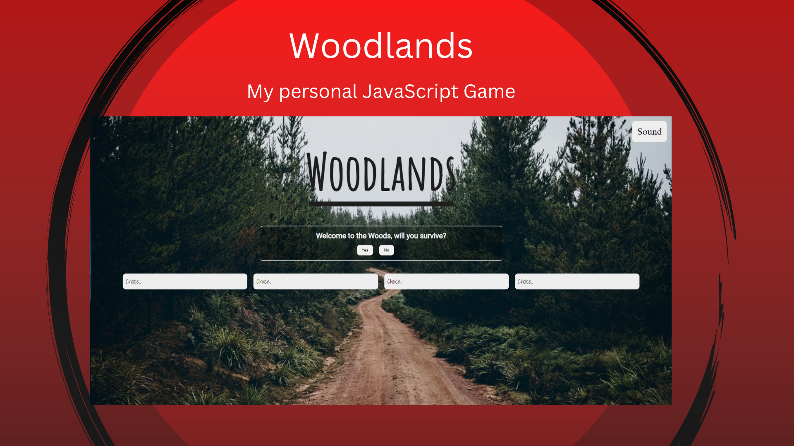

# Milestone-project-1

Woodlands is a solo interactive fiction game I created using only HTML5, CSS3 and JavaScript.

Website URL: [https://angeltheesoto.github.io/Milestone-project-1/](https://angeltheesoto.github.io/Milestone-project-1/)

How to play:

- You will be given a starter dialogue and will have to choose between multiple choices on trying to escape the woods alive. Each choice is given a unique story towards your journey home. You will need a mouse and a screen. For the controls all you need is to point and click on your choices.

Technologies used when developing this game:

- HTML | CSS | JavaScript
- git | gitHub
- VSCode
